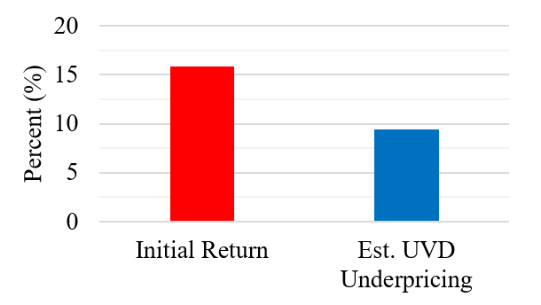

# Demo: Collapsible with Image + Text

  
Example section (image left, text right)

  

    

      <figure class="media">
        
        <figcaption>Optional caption for the image.</figcaption>
      </figure>
      

        
<strong>Side-by-side content inside a collapsible.</strong> This layout uses standard HTML
        <code>&lt;details&gt;</code>/<code>&lt;summary&gt;</code> plus a flexbox row to place an image next to rich text.

        
Add any Markdown or HTML here—links, lists, additional images, even tables.

        
Example link style: <a href="https://example.com">Visit example.com</a>

      

    

  

  
Image on the right (swap column order)

  

    

      

        
Put the text column first and the image column second to flip the visual order.

        <ul>
          <li>Keyboard accessible</li>
          <li>Mobile-friendly: columns stack automatically</li>
          <li>No JavaScript needed</li>
        </ul>
      

      <figure class="media">
        
        <figcaption>Another optional caption.</figcaption>
      </figure>
    

  

  
Multiple rows in one panel

  

    

      <figure class="media">
        
      </figure>
      

        
You can stack additional rows by repeating the <code>.row</code> block.

      

    

    

      <figure class="media">
        
      </figure>
      

        
Each row remains responsive and will stack on narrow screens.

      

    

  

